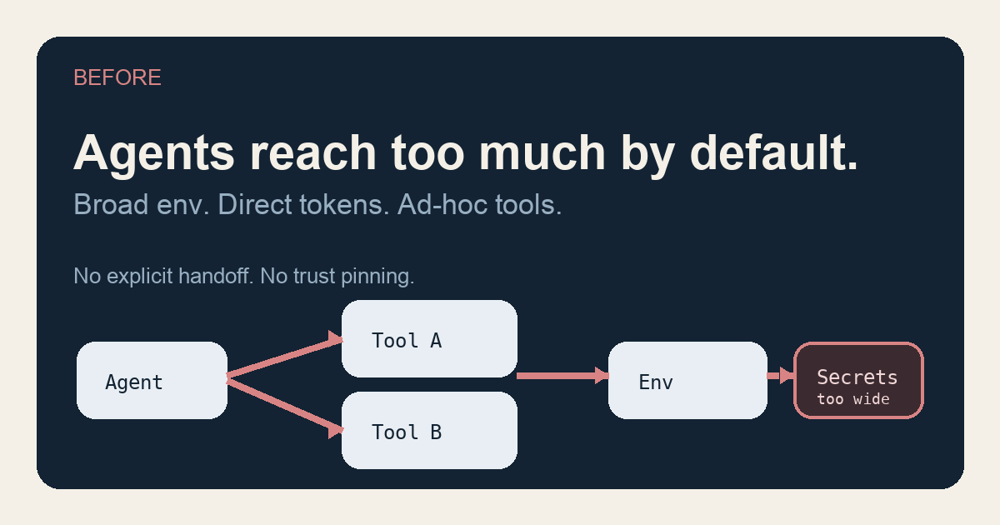
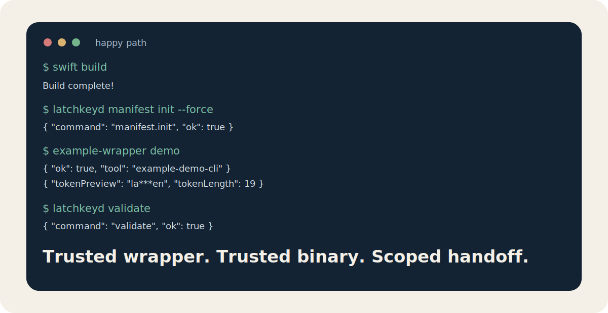
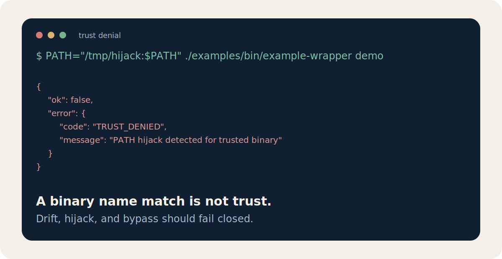
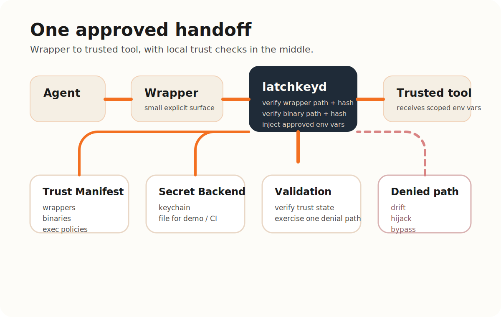

# latchkeyd


Local trust gate and secret broker for agent-driven developer workflows.

`latchkeyd` helps local agents use real tools without turning your shell into a generic credential vending machine.



```bash
LATCHKEYD_BIN="$PWD/.build/debug/latchkeyd" ./examples/bin/example-wrapper demo
```

## Two risks, one tool

- **Credential sprawl**: local agents become hard to trust when real credentials leak into broad env state, direct token use, or ad-hoc tool discovery.
- **Prompt-injection fallout**: remote content can influence an agent to attempt unsafe local actions, especially when the workstation has no explicit handoff boundary.

`latchkeyd` is built for the middle:

- secrets stay local
- wrappers and binaries are trust-pinned
- secret release is explicit
- drift, hijack, and bypass fail closed

## See It In Action

### The Happy Path

Build, initialize trust, run the wrapper, validate the workstation:



### The Trust Denial

Put the wrong binary in `PATH` and the broker rejects it instead of handing over the secret:



More walkthroughs:

- [`docs/demos/HAPPY_PATH.md`](docs/demos/HAPPY_PATH.md)
- [`docs/demos/TRUST_FAILURES.md`](docs/demos/TRUST_FAILURES.md)

## Quick Start

### 1. Build

```bash
swift build
```

### 2. Initialize the example manifest

```bash
./.build/debug/latchkeyd manifest init --force
./.build/debug/latchkeyd manifest refresh
```

### 3. Run the example wrapper

```bash
LATCHKEYD_BIN="$PWD/.build/debug/latchkeyd" ./examples/bin/example-wrapper demo
```

### 4. Validate the setup

```bash
LATCHKEYD_BIN="$PWD/.build/debug/latchkeyd" ./.build/debug/latchkeyd validate
```

The example setup uses:

- [`examples/bin/example-wrapper`](examples/bin/example-wrapper)
- [`examples/bin/example-demo-cli`](examples/bin/example-demo-cli)
- [`examples/file-backend/demo-secrets.json`](examples/file-backend/demo-secrets.json)

For real workstation use, the intended backend is `keychain`. The `file` backend exists to make demos, tests, CI, and first-run evaluation easy.

## What It Is

`latchkeyd` is a macOS-first local broker for secret-scoped tool execution.

It verifies:

- the wrapper asking for access
- the downstream binary that would receive access
- the manifest policy that allows that handoff

Then it injects only the named environment variables approved for that exact action and `exec`s the trusted command.

## What Makes It Different

- local-first: no cloud control plane required
- your system, your rules: trust is defined by the local manifest you control
- explicit secret handoff: there is no generic "fetch me any secret" API
- trust-pinned execution: both wrapper and binary are verified
- fail closed on drift: path changes, hash changes, and hijacks stop the run
- built for agent workflows: this is about safer local tool use, not generic app configuration

## Why Local-First Matters

If the safety story depends on a cloud broker, remote policy service, or hosted execution boundary, the user no longer owns the full trust root.

`latchkeyd` takes a different position:

- the trust root is local
- the secret store is local
- the handoff policy is local
- the operator can inspect the actual trusted paths and hashes

That makes the system easier to reason about for a single-user workstation and reduces reliance on cloud-side assumptions.

## How This Helps With Prompt-Injection Fallout

Prompt injection is not something a local broker can solve universally.

What `latchkeyd` does is narrow the blast radius once an agent is already allowed to run local tools:

- remote content cannot directly get secrets just by influencing model output
- wrappers can remain small, explicit, and purpose-built
- broad inherited env state is replaced with explicit handoff
- a tool name alone is not trusted; the real path and hash must match

This is defense in depth for approved local workflows, not a blanket claim of secure agents.

## How It Works

1. The agent calls a wrapper.
2. The wrapper normalizes the request and calls `latchkeyd`.
3. `latchkeyd` verifies the trusted wrapper path and hash.
4. `latchkeyd` verifies the trusted downstream binary path and hash.
5. `latchkeyd` resolves only the secret entries approved by policy.
6. `latchkeyd` injects only the approved environment variables and `exec`s the command.



## Trust Failures You Should Expect

The alpha is meant to make trust failure obvious and reproducible.

Examples:

- edit the example wrapper and run `latchkeyd manifest verify` before refresh to see wrapper drift denial
- prepend a fake `example-demo-cli` earlier in `PATH` to trigger PATH hijack denial
- call `latchkeyd exec` directly with an untrusted `--caller` path to trigger caller denial
- point the file backend at a missing file to trigger backend configuration denial

## Operator Recovery Path

When trust checks fail, the intended operator loop is simple:

1. inspect the failing wrapper, binary, or backend path
2. decide whether the change is expected
3. if it is expected, re-pin with `latchkeyd manifest refresh`
4. if it is not expected, stop and investigate instead of weakening the policy

The secure path should be the shortest path, but it should never silently self-heal.

## Public Command Surface

- `latchkeyd status`
- `latchkeyd manifest init`
- `latchkeyd manifest refresh`
- `latchkeyd manifest verify`
- `latchkeyd exec`
- `latchkeyd validate`

Default manifest path:

- `~/Library/Application Support/latchkeyd/manifest.json`

Default event log path:

- `~/Library/Application Support/latchkeyd/events.jsonl`

Use `--manifest PATH` to override the manifest location.

## Current Alpha Scope

Current alpha scope:

- SwiftPM package with a real `latchkeyd` CLI
- manifest init, refresh, verify, and validate commands
- `file` and `keychain` secret backends
- a reference Bash wrapper plus a harmless demo CLI
- JSONL event logging
- GitHub Actions CI and release workflows

Intentional non-goals for this alpha:

- long-running daemon mode
- provider-specific integrations
- HTTP-specific broker commands
- cross-platform backends
- signing and notarization

## Who This Is For

- engineers using local coding agents with real credentials
- advanced developers building wrapper-first local automations
- teams exploring safer trust boundaries for internal agent tooling

## What It Does Not Solve

- same-user full compromise
- browser or session-store compromise
- generic endpoint policy for every API
- OS-level isolation
- "secure agents solved"

This project should be understood as local defense in depth for approved workflows.

## Repository Guide

- [`docs/ARCHITECTURE.md`](docs/ARCHITECTURE.md)
- [`docs/THREAT_MODEL.md`](docs/THREAT_MODEL.md)
- [`docs/ROADMAP.md`](docs/ROADMAP.md)
- [`examples/wrapper-contract.md`](examples/wrapper-contract.md)

## Release Shape

The broker core is a Swift command-line tool.

Current distribution shape:

- source build via Swift Package Manager
- GitHub Actions workflows for CI and tagged releases
- release binaries and checksums from GitHub Releases once tags are cut

Later possibilities:

- Homebrew distribution
- signed and notarized binaries
- broader wrapper ecosystem

## Project Support

- [`CHANGELOG.md`](CHANGELOG.md)
- [`docs/RELEASE_RUNBOOK.md`](docs/RELEASE_RUNBOOK.md)
- [`docs/ANNOUNCEMENT_DRAFT.md`](docs/ANNOUNCEMENT_DRAFT.md)

## One-Line Summary

`latchkeyd` gives local agents a narrower, auditable, fail-closed way to use real tools with real credentials.
