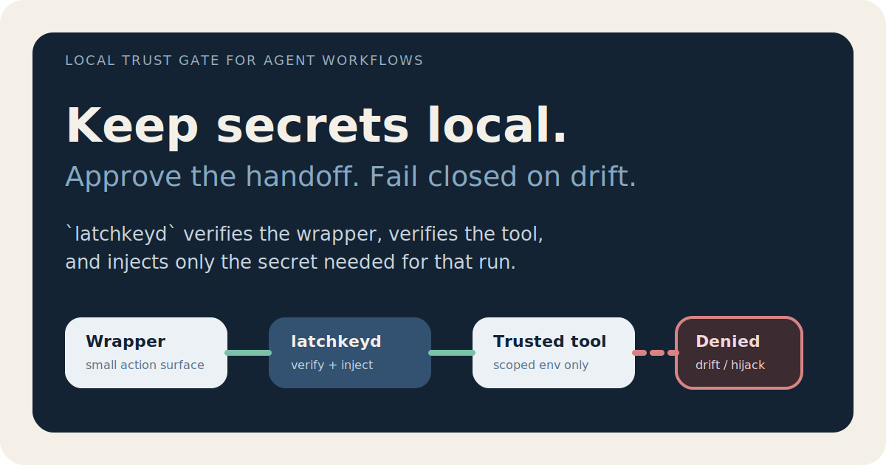

# latchkeyd

Local trust gate and secret broker for agent-driven developer workflows.

`latchkeyd` helps local agents use real tools without turning your shell into a generic credential vending machine.



## Why this exists

Local coding agents become risky when they start improvising with:

- direct token use
- raw API calls
- ad-hoc CLI discovery
- broad environment inheritance
- fallback auth paths
- remote content steering local tools into unsafe execution

Most local setups force a bad choice:

- give the agent too little access and it stops being useful
- give it broad local access and it becomes hard to trust

`latchkeyd` is aimed at the middle.

It keeps secrets local, pins trust to approved wrappers and binaries, and releases only the exact secret handoff required for an approved local action.

## What it is

`latchkeyd` is a macOS-first local broker for secret-scoped tool execution.

It verifies:

- the wrapper asking for access
- the downstream binary that would receive access
- the manifest policy that allows that handoff

Then it injects only the named environment variables approved for that exact action and `exec`s the trusted command.

## What makes it different

- local-first: no cloud control plane required
- your system, your rules: trust is defined by the local manifest you control
- explicit secret handoff: there is no generic "fetch me any secret" API
- trust-pinned execution: both wrapper and binary are verified
- fail closed on drift: path changes, hash changes, and hijacks stop the run
- built for agent workflows: this is about safer local tool use, not generic app configuration

## Current status

`latchkeyd` is a working public alpha.

Current alpha scope:

- SwiftPM package with a real `latchkeyd` CLI
- manifest init, refresh, verify, and validate commands
- `file` and `keychain` secret backends
- a reference Bash wrapper plus a harmless demo CLI
- JSONL event logging
- GitHub Actions CI and release workflows

Intentional non-goals for this alpha:

- long-running daemon mode
- provider-specific integrations
- HTTP-specific broker commands
- cross-platform backends
- signing and notarization

## Why local-first matters

If the safety story depends on a cloud broker, remote policy service, or hosted execution boundary, the user no longer owns the full trust root.

`latchkeyd` takes a different position:

- the trust root is local
- the secret store is local
- the handoff policy is local
- the operator can inspect the actual trusted paths and hashes

That makes the system easier to reason about for a single-user workstation and reduces reliance on cloud-side assumptions.

## How this helps with prompt-injection fallout

Prompt injection is not something a local broker can "solve" universally.

What `latchkeyd` does is narrow the blast radius once an agent is already allowed to run local tools:

- remote content cannot directly get secrets just by influencing model output
- wrappers can remain small, explicit, and purpose-built
- broad inherited env state is replaced with explicit handoff
- a tool name alone is not trusted; the real path and hash must match

This is defense in depth for approved local workflows, not a blanket claim of secure agents.

## How it works

1. The agent calls a wrapper.
2. The wrapper normalizes the request and calls `latchkeyd`.
3. `latchkeyd` verifies the trusted wrapper path and hash.
4. `latchkeyd` verifies the trusted downstream binary path and hash.
5. `latchkeyd` resolves only the secret entries approved by policy.
6. `latchkeyd` injects only the approved environment variables and `exec`s the command.


## Five-minute quickstart

Build:

```bash
swift build
```

Initialize the example manifest:

```bash
./.build/debug/latchkeyd manifest init --force
./.build/debug/latchkeyd manifest refresh
```

Run the example wrapper:

```bash
LATCHKEYD_BIN="$PWD/.build/debug/latchkeyd" ./examples/bin/example-wrapper demo
```

Validate the setup:

```bash
LATCHKEYD_BIN="$PWD/.build/debug/latchkeyd" ./.build/debug/latchkeyd validate
```

The example setup uses:

- [`examples/bin/example-wrapper`](examples/bin/example-wrapper)
- [`examples/bin/example-demo-cli`](examples/bin/example-demo-cli)
- [`examples/file-backend/demo-secrets.json`](examples/file-backend/demo-secrets.json)

For real workstation use, the intended backend is `keychain`. The `file` backend exists to make demos, tests, CI, and first-run evaluation easy.

## Demo package

The repo now includes a public demo package:

- [`docs/demos/HAPPY_PATH.md`](docs/demos/HAPPY_PATH.md) for the fast success walkthrough
- [`docs/demos/TRUST_FAILURES.md`](docs/demos/TRUST_FAILURES.md) for reproducible trust denials

Happy-path preview:


## What success looks like

On the happy path:

- the wrapper succeeds
- the broker verifies both trust boundaries
- the trusted binary receives only the approved secret env var
- no raw secret is printed
- the event log records the action without logging secret material

## Trust failures you should expect

The alpha is meant to make trust failure obvious and reproducible.

Examples:

- edit the example wrapper and run `latchkeyd manifest verify` before refresh to see wrapper drift denial
- prepend a fake `example-demo-cli` earlier in `PATH` to trigger PATH hijack denial
- call `latchkeyd exec` directly with an untrusted `--caller` path to trigger caller denial
- point the file backend at a missing file to trigger backend configuration denial

Denial preview:


## Operator recovery path

When trust checks fail, the intended operator loop is simple:

1. inspect the failing wrapper, binary, or backend path
2. decide whether the change is expected
3. if it is expected, re-pin with `latchkeyd manifest refresh`
4. if it is not expected, stop and investigate instead of weakening the policy

The secure path should be the shortest path, but it should never silently self-heal.

## Public command surface

- `latchkeyd status`
- `latchkeyd manifest init`
- `latchkeyd manifest refresh`
- `latchkeyd manifest verify`
- `latchkeyd exec`
- `latchkeyd validate`

Default manifest path:

- `~/Library/Application Support/latchkeyd/manifest.json`

Default event log path:

- `~/Library/Application Support/latchkeyd/events.jsonl`

Use `--manifest PATH` to override the manifest location.

## Who this is for

- engineers using local coding agents with real credentials
- advanced developers building wrapper-first local automations
- teams exploring safer trust boundaries for internal agent tooling

## What it does not claim to solve

- same-user full compromise
- browser or session-store compromise
- generic endpoint policy for every API
- OS-level isolation
- "secure agents solved"

This project should be understood as local defense in depth for approved workflows.

## Repository guide

- [`docs/ARCHITECTURE.md`](docs/ARCHITECTURE.md) for the system shape
- [`docs/THREAT_MODEL.md`](docs/THREAT_MODEL.md) for the security framing
- [`docs/ROADMAP.md`](docs/ROADMAP.md) for implementation sequence
- [`examples/wrapper-contract.md`](examples/wrapper-contract.md) for wrapper-facing expectations

## Release shape

The broker core is a Swift command-line tool.

Current distribution shape:

- source build via Swift Package Manager
- GitHub Actions workflows for CI and tagged releases
- release binaries and checksums from GitHub Releases once tags are cut

Later possibilities:

- Homebrew distribution
- signed and notarized binaries
- broader wrapper ecosystem

## Project support

- [`CHANGELOG.md`](CHANGELOG.md) tracks release-facing changes
- [`docs/RELEASE_RUNBOOK.md`](docs/RELEASE_RUNBOOK.md) documents the release process
- [`docs/ANNOUNCEMENT_DRAFT.md`](docs/ANNOUNCEMENT_DRAFT.md) holds launch copy to refine before public release

## One-line summary

`latchkeyd` gives local agents a narrower, auditable, fail-closed way to use real tools with real credentials.
