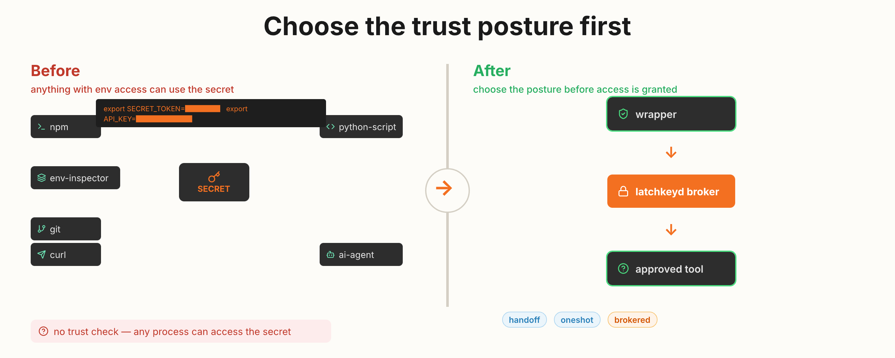
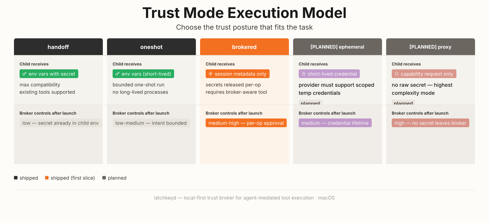
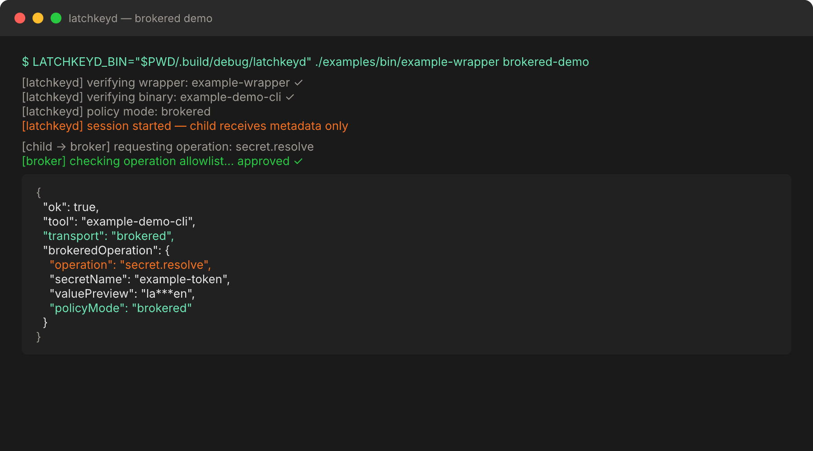
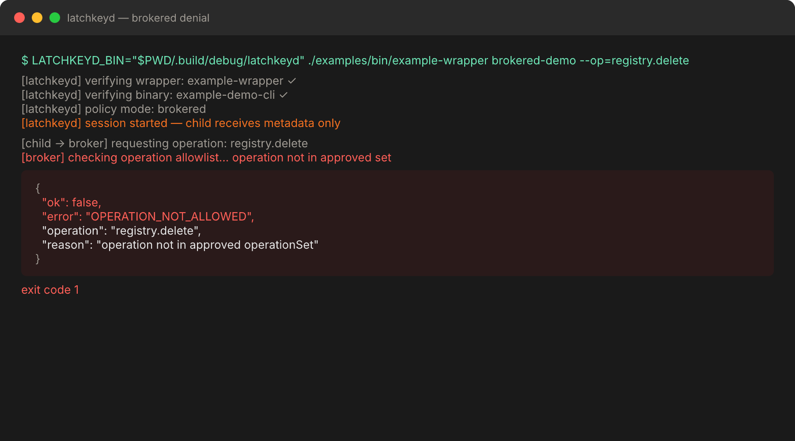

# latchkeyd


[](https://github.com/cote-star/latchkeyd)

**Choose the trust posture before a local tool gets credential-backed access.**

`latchkeyd` is a macOS local trust broker for agent-mediated tool execution. It keeps secrets local, pins the wrapper and binary that are allowed to use them, and lets you decide whether a task should use direct handoff, a bounded one-shot path, or a brokered request path.

> If you use local coding agents with real credentials, `latchkeyd` gives you a narrower, evidence-backed trust boundary between wrapper and tool.



```bash
LATCHKEYD_BIN="$PWD/.build/debug/latchkeyd" ./examples/bin/example-wrapper brokered-demo
```

Proof:

- current public release: `v0.1.0-alpha.3`
- hosted CI and hosted release workflows are live in the repo
- published binary and checksum are part of the release shape

**Two problems, one tool:**

- **Credential sprawl**: local agents become hard to trust when real credentials leak into broad env state, direct token use, or ad-hoc tool discovery.
- **Prompt-injection fallout**: remote content can influence an agent to attempt unsafe local actions, especially when the workstation has no explicit handoff boundary.

`latchkeyd` is built for the middle:

- secrets stay local
- wrappers and binaries are trust-pinned
- secret release is explicit
- drift, hijack, and bypass fail closed

## Choose Your Trust Mode

The repo is moving from one execution model to a small family of explicit trust postures.

| Mode | Best for | What the child receives | Main limit | Current state |
| :--- | :--- | :--- | :--- | :--- |
| `handoff` | maximum compatibility with existing tools | approved env vars at launch | child can retain or re-export the secret | shipped |
| `oneshot` | bounded publish or release commands | approved env vars for one short-lived run | still visible to that command while it runs | shipped as first slice |
| `brokered` | per-operation control and tighter request boundaries | session metadata at launch, secret only on approved request | first slice is narrow and not same-user isolation | shipped as first slice in the repo |
| `ephemeral` | provider flows that support short-lived credentials | scoped short-lived credentials | depends on provider support | planned |
| `proxy` | highest-risk or secretless workflows | capability access without raw secret handoff | highest implementation complexity | planned |

This is the main product shift:

- from explicit handoff before execution
- to explicit, user-chosen trust posture per task



## See It In Action

### Approved Brokered Request

Build, initialize trust, run the wrapper, validate the workstation:



This demonstrates the shipped brokered path: wrapper and binary are verified, the child starts with session metadata only, and one approved brokered request succeeds.

### Denied Brokered Request

Ask for an operation that is not approved and the broker rejects it inside the active session:



This demonstrates the fail-closed brokered story: a running trusted child still does not get arbitrary broker access, and no secret value is returned for an unapproved operation.

More walkthroughs:

- [`docs/demos/HAPPY_PATH.md`](docs/demos/HAPPY_PATH.md)
- [`docs/demos/TRUST_FAILURES.md`](docs/demos/TRUST_FAILURES.md)
- [`docs/demos/MODE_SELECTION.md`](docs/demos/MODE_SELECTION.md)

## Current Guarantee

`latchkeyd` currently guarantees:

- the selected policy mode is explicit in the manifest
- the wrapper asking for access is trust-pinned
- the downstream binary is trust-pinned
- only policy-approved secret names or brokered operations are allowed
- drift, hijack, and bypass fail closed
- brokered operations are audited, and logging failure is an explicit error

## Not Guaranteed After Handoff

`handoff` and `oneshot` do not confine a trusted child after it receives secret material.

That means:

- the child can still retain or re-export the secret while it runs
- `oneshot` narrows lifetime intent, not post-handoff control
- the first brokered slice narrows request boundaries, but it is not same-user isolation

This repo should be read as practical defense in depth for approved local workflows, not “secure agents solved.”

## Structured Output And Audit Contract

`status`, `manifest` commands, `validate`, and structured errors emit JSON that is safe to inspect, script, or log.

`exec` inherits stdout and stderr from the trusted child. Review child output before relying on its shape.

Event logging is part of the enforced audit contract:

- `exec` and `validate` preflight the event log path
- `LOGGING_ERROR` is returned if audit logging is unavailable up front
- `LOGGING_ERROR` is also returned if the log append fails after command processing has started

Example child output:

```json
{
  "ok": true,
  "tool": "example-demo-cli",
  "transport": "brokered",
  "args": [
    "smoke"
  ],
  "brokeredOperation": {
    "operation": "secret.resolve",
    "secretName": "example-token",
    "valuePreview": "la***en",
    "valueLength": 19,
    "policyName": "example-brokered",
    "policyMode": "brokered"
  }
}
```

## Quick Start

### 1. Build

```bash
swift build
```

### 2. Initialize the example manifest

```bash
./.build/debug/latchkeyd manifest init --force
./.build/debug/latchkeyd manifest refresh
```

### 3. Run the handoff example

```bash
LATCHKEYD_BIN="$PWD/.build/debug/latchkeyd" ./examples/bin/example-wrapper demo
```

### 4. Run the brokered example

```bash
LATCHKEYD_BIN="$PWD/.build/debug/latchkeyd" ./examples/bin/example-wrapper brokered-demo
```

### 5. Validate the setup

```bash
LATCHKEYD_BIN="$PWD/.build/debug/latchkeyd" ./.build/debug/latchkeyd validate
```

### 6. Optional: prove the core path works offline

```bash
./scripts/offline_smoke.sh
```

The example setup uses:

- [`examples/bin/example-wrapper`](examples/bin/example-wrapper)
- [`examples/bin/example-demo-cli`](examples/bin/example-demo-cli)
- [`examples/file-backend/demo-secrets.json`](examples/file-backend/demo-secrets.json)

For real workstation use, the intended backend is `keychain`. The `file` backend exists to make demos, tests, CI, and first-run evaluation easy.

## Why This Exists

Most local agent setups end up with one of two bad patterns:

- broad inherited env state that every tool can see
- wrapper scripts that assume the tool name alone is enough to trust

`latchkeyd` exists to put a local trust check in the middle of that flow and let the operator choose how narrow the release path should be.

## What It Is

`latchkeyd` is a macOS-first local trust broker for secret-scoped tool execution. It verifies:

- the wrapper asking for access
- the downstream binary that would receive access
- the manifest policy that allows that access
- the trust mode attached to that policy

Depending on the mode, it either:

- injects approved env vars and launches the tool
- enforces a bounded one-shot path
- or creates a brokered local session so the child can request an approved operation later

## What Makes It Different

- local-first: no cloud control plane required
- your system, your rules: trust is defined by the local manifest you control
- user-owned trust posture: choose compatibility, bounded execution, or request-time brokerage by task
- trust-pinned execution: both wrapper and binary are verified
- fail closed on drift: path changes, hash changes, and hijacks stop the run
- built for agent workflows: this is about safer local tool use, not generic app configuration

## Why Local-First Matters

If the safety story depends on a cloud broker, remote policy service, or hosted execution boundary, the user no longer owns the full trust root.

`latchkeyd` takes a different position:

- the trust root is local
- the secret store is local
- the handoff policy is local
- the operator can inspect the actual trusted paths and hashes

Offline operation is supported because every run reads local manifest and event files and negotiates with local binaries. The dedicated `scripts/offline_smoke.sh` proves that the core path works with every proxy pointed at invalid endpoints.

## How This Helps With Prompt-Injection Fallout

Prompt injection is not something a local broker can solve universally.

What `latchkeyd` does is narrow the blast radius once an agent is already allowed to run local tools:

- remote content cannot directly get secrets just by influencing model output
- wrappers can remain small, explicit, and purpose-built
- broad inherited env state is replaced with explicit handoff or explicit brokered request boundaries
- a tool name alone is not trusted; the real path and hash must match


This is defense in depth for approved local workflows, not a blanket claim of secure agents.

## How It Works

### Handoff And Oneshot

1. The agent calls a wrapper.
2. The wrapper normalizes the request and calls `latchkeyd`.
3. `latchkeyd` verifies the trusted wrapper path and hash.
4. `latchkeyd` verifies the trusted downstream binary path and hash.
5. `latchkeyd` resolves only the secret entries approved by policy.
6. `latchkeyd` injects only the approved env vars and launches the command.

### Brokered

1. The agent calls a wrapper.
2. The wrapper calls `latchkeyd exec` for a brokered policy.
3. `latchkeyd` verifies the wrapper, binary, policy, and operation set.
4. `latchkeyd` launches the child without raw secret env vars.
5. The child receives only session metadata.
6. The child asks the broker for an approved operation such as `secret.resolve`.
7. The broker checks the live session, operation allowlist, and secret binding before returning a result.


## Trust Failures You Should Expect

Examples:

- edit the example wrapper and run `latchkeyd manifest verify` before refresh to see wrapper drift denial
- prepend a fake `example-demo-cli` earlier in `PATH` to trigger PATH hijack denial
- call `latchkeyd exec` directly with an untrusted `--caller` path to trigger caller denial
- point the file backend at a missing file to trigger backend configuration denial
- request an unsupported brokered operation to trigger `OPERATION_NOT_ALLOWED`

## Operator Recovery Path

When trust checks fail, the intended operator loop is simple:

1. inspect the failing wrapper, binary, backend path, or brokered operation
2. decide whether the change is expected
3. if it is expected, re-pin with `latchkeyd manifest refresh`
4. if it is not expected, stop and investigate instead of weakening the policy

The secure path should be the shortest path, but it should never silently self-heal.

## How It Compares

| | `latchkeyd` | Broad env vars | Cloud broker only |
| :--- | :---: | :---: | :---: |
| **Secrets stay local** | Yes | Yes | No |
| **Wrapper trust-pinning** | Yes | No | Varies |
| **Binary trust-pinning** | Yes | No | Varies |
| **Fail-closed on drift** | Yes | No | Policy-dependent |
| **Works offline** | Yes (`scripts/offline_smoke.sh` proves the core path) | Yes | No |
| **Operator can inspect the trust root** | Yes | Partial | No |
| **Mode-specific trust posture** | Yes | No | Varies |

## Public Command Surface

- `latchkeyd status`
- `latchkeyd manifest init`
- `latchkeyd manifest refresh`
- `latchkeyd manifest verify`
- `latchkeyd exec`
- `latchkeyd validate`

Default manifest path:

- `~/Library/Application Support/latchkeyd/manifest.json`

Default event log path:

- `~/Library/Application Support/latchkeyd/events.jsonl`

Use `--manifest PATH` to override the manifest location.

## Current Alpha Scope

Current alpha scope:

- macOS-only SwiftPM package with a real `latchkeyd` CLI
- versioned trust manifests with explicit policy modes
- `handoff`, `oneshot`, and a first brokered slice
- `file` and `keychain` secret backends
- a reference Bash wrapper plus a harmless demo CLI
- JSONL event logging with enforced audit preflight and `LOGGING_ERROR`
- `scripts/offline_smoke.sh` for dedicated offline proof
- `scripts/local_workflow_parity.sh` for local release-prep parity
- GitHub Actions CI and release workflows

Accepted limits for this alpha:

- no long-running daemon mode
- no provider-specific integrations yet
- no same-user compromise claim
- no full secretless capability model yet
- no cross-platform backend story yet

## What Comes Next

- stronger `oneshot` lifetime enforcement
- broader `brokered` operations and session controls
- `ephemeral` and `proxy` modes for stricter workflows

## Who This Is For

- engineers using local coding agents with real credentials
- advanced developers building wrapper-first local automations
- teams exploring safer trust boundaries for internal agent tooling

## What It Does Not Solve

- same-user full compromise
- browser or session-store compromise
- generic endpoint policy for every API
- OS-level isolation
- "secure agents solved"

This project should be understood as local defense in depth for approved workflows.

## Repository Guide

- [`docs/ARCHITECTURE.md`](docs/ARCHITECTURE.md)
- [`docs/THREAT_MODEL.md`](docs/THREAT_MODEL.md)
- [`docs/ROADMAP.md`](docs/ROADMAP.md)
- [`docs/REPO_METADATA.md`](docs/REPO_METADATA.md)
- [`docs/TRUST_MODES_SPEC.md`](docs/TRUST_MODES_SPEC.md)
- [`docs/MANIFEST_EVOLUTION_SPEC.md`](docs/MANIFEST_EVOLUTION_SPEC.md)
- [`docs/CLI_MODE_UX_SPEC.md`](docs/CLI_MODE_UX_SPEC.md)
- [`docs/WRAPPER_MODE_GUIDE.md`](docs/WRAPPER_MODE_GUIDE.md)
- [`examples/wrapper-contract.md`](examples/wrapper-contract.md)

## Release Shape

The broker core is a Swift command-line tool.

Current distribution shape:

- source build via Swift Package Manager
- GitHub Actions workflows for CI and tagged releases
- release binaries and checksums from GitHub Releases once tags are cut

Later possibilities:

- Homebrew distribution
- signed and notarized binaries
- broader wrapper ecosystem

Release candidates should pass `scripts/local_workflow_parity.sh` and `scripts/offline_smoke.sh` locally before cutting a tag, but the hosted GitHub release workflow remains the authoritative gate for public assets.

## Project Support

- [`CHANGELOG.md`](CHANGELOG.md)
- [`docs/RELEASE_RUNBOOK.md`](docs/RELEASE_RUNBOOK.md)
- [`docs/ANNOUNCEMENT_DRAFT.md`](docs/ANNOUNCEMENT_DRAFT.md)

## One-Line Summary

`latchkeyd` gives local agents a narrower, auditable, fail-closed way to use real tools with real credentials while letting the operator choose the trust posture per task.
